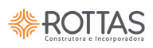

# Marca / Logo

Identidade visual da **Rottas Construtora e Incorporadora**. Existem **3 assets de logo** em uso no app, cada um para um contexto. Os arquivos de origem ficam em `public/Brand/` e `src/assets/`; as cópias em [`brand/`](brand/) abaixo são apenas para preview desta doc.

> **Regra inegociável:** não recrie/edite o logo em SVG inline nem aproxime as cores "no olho". Sempre importe um dos 3 assets abaixo.

## Assets em uso

| Preview | Asset | Formato / dim. | Onde é usado | Como importar |
|---|---|---|---|---|
|  | **Símbolo laranja** (sólido) | PNG · 500×500 | Sidebar (recolhida e expandida) — [AppSidebar.tsx:79](../../src/components/AppSidebar.tsx#L79) | `src="/Brand/rottas_logo_laranja.png"` (fica em `public/`, referência por URL absoluta) |
|  | **Símbolo login** (gradiente) | AVIF · 96×96 | Telas de auth: [Login](../../src/pages/Login.tsx), [AceitarConvite](../../src/pages/AceitarConvite.tsx), [ResetPassword](../../src/pages/ResetPassword.tsx), [SolicitarCadastro](../../src/pages/SolicitarCadastro.tsx) | `import rottasLogo from "@/assets/logo-rottas-login.avif"` |
|  | **Lockup horizontal** (símbolo + wordmark + tagline) | AVIF · 192×61 | [Navbar](../../src/components/Navbar.tsx) e landing [Index](../../src/pages/Index.tsx) | `import logoGray from "@/assets/logo-rottas-gray.avif"` |
|  | **Favicon / app icon** (símbolo cream sobre quadrado laranja arredondado) | ICO · 300×300 | Aba do navegador — [index.html:8](../../index.html#L8) | `<link rel="icon" href="/favicon2.ico" />` (fica em `public/`) |

> O **símbolo laranja**, o **símbolo login** e o **favicon** são o mesmo desenho (4 pontas entrelaçadas); diferem no acabamento: sólido laranja (PNG público), gradiente (AVIF auth) e invertido/cream sobre fundo laranja (favicon). Não unifique — cada um já tem seu lugar de uso.

## Tamanhos reais em uso

Não há constante de tamanho para logo — segue a escala real aplicada hoje:

| Contexto | Asset | Classe / tamanho |
|---|---|---|
| Sidebar expandida | símbolo laranja | `h-7 w-7` (28px) |
| Sidebar recolhida (`collapsible=icon`) | símbolo laranja | `h-6 w-6` (24px) |
| Telas de auth | símbolo login | `h-12 w-auto` (48px) |
| Navbar | lockup horizontal | `h-8` (32px) |
| Landing (hero) | lockup horizontal | `h-[26px]` |
| Login e Solicitar acesso (painel laranja) | símbolo login | `h-7` dentro de um quadrado branco de 44px, `rounded-xl`. Vem do [ShowcasePanel](../../src/components/auth/ShowcasePanel.tsx), compartilhado pelas duas telas. |

Sempre use `object-contain` ao restringir largura+altura, para não distorcer (o lockup é ~3:1; o símbolo é 1:1).

## Cor de marca

O laranja da marca é o **`--primary`** do tema: `39 96% 48%` = **`#f29f05`**. Ver [tokens.md](tokens.md).

- Em JSX, refira via token (`bg-primary`, `text-primary`) ou CSS var — nunca `#f29f05` literal.
- **Item ativo da sidebar não usa mais cor de marca:** foi trocado para cinza discreto (`#EEEFF4` fundo / `gray-700` texto e ícone) — ver [navegacao.md](navegacao.md).
- O símbolo **login** tem um leve gradiente laranja embutido no próprio arquivo; não tente reproduzir esse gradiente em CSS.

## Faça / Não faça

✅ **Faça**
- Importe sempre um dos 3 assets pelos caminhos da tabela acima.
- Deixe área de respiro proporcional ao tamanho do símbolo (~½ da altura do logo) em volta.
- Use o **lockup horizontal** quando precisar do nome "ROTTAS" legível; o **símbolo** sozinho quando o espaço é apertado (sidebar, favicon, auth).
- Mantenha `alt="Rottas"`.

❌ **Não faça**
- Não recrie o logo em SVG/CSS nem aplique `fill`/`stroke` por cima dos assets.
- Não distorça (sempre `w-auto` ou `object-contain`).
- Não troque a cor do logo nem aplique filtros de tom.
- Não use o lockup em tamanho < 24px de altura (o wordmark/tagline fica ilegível) — abaixo disso, use só o símbolo.

## Arquivos

| Origem (usar no código) | Cópia para preview (esta doc) |
|---|---|
| [public/Brand/rottas_logo_laranja.png](../../public/Brand/rottas_logo_laranja.png) | [brand/rottas-simbolo-laranja.png](brand/rottas-simbolo-laranja.png) |
| [src/assets/logo-rottas-login.avif](../../src/assets/logo-rottas-login.avif) | [brand/rottas-simbolo-login.png](brand/rottas-simbolo-login.png) |
| [src/assets/logo-rottas-gray.avif](../../src/assets/logo-rottas-gray.avif) | [brand/rottas-lockup-horizontal.png](brand/rottas-lockup-horizontal.png) |
| [public/favicon2.ico](../../public/favicon2.ico) | [brand/rottas-favicon.png](brand/rottas-favicon.png) |

> **Quirk do favicon:** o arquivo se chama `favicon2.ico` (não há `favicon.ico` na raiz). O [index.html:8](../../index.html#L8) aponta explicitamente para `/favicon2.ico` — não renomeie sem ajustar o `<link>`.

> Ao adicionar uma nova variação de logo (ex: versão branca/monocromática, apple-touch-icon, PWA manifest icons), suba o arquivo de origem em `public/Brand/`, `public/` ou `src/assets/`, gere a cópia PNG em `brand/` e atualize a tabela acima.
